# Lab3Web

# NAMA  : IBNU FAJAR
# NIM   : 312010420
# KELAS : TI. 20. A1

 **LANGKAH-LANGKAH PERAKTIKUM**
 Seperti biasa kalian buka Visual Studio Code Dileptop kalian dan lakukan seperti biasa membuat *file html*, tetapi berjumlah 3 file, file prtama untuk belajar membuat list, file kedua belajar membuat tabel, dan file ke tiga belajar membuat from.

 **1. File Pertama Dinamakan "Lab3_list.html"**
 Disini yang pertama, kalian lakukan pembuatan *Ordered List* dengan kode perintah seperti gambar berikut:
 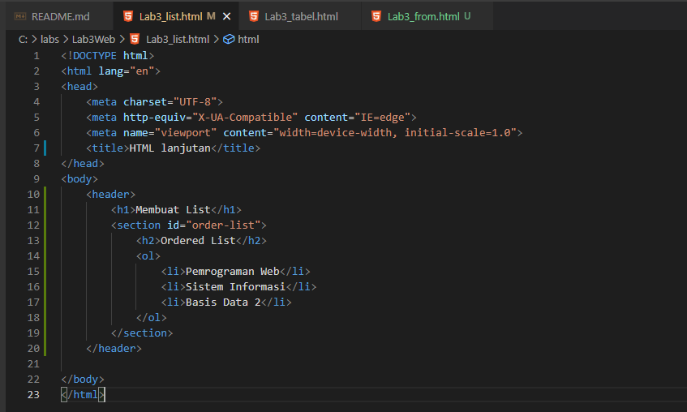
 Seprti biasa kalian run dan lihat hasilnya digoogle crome.
 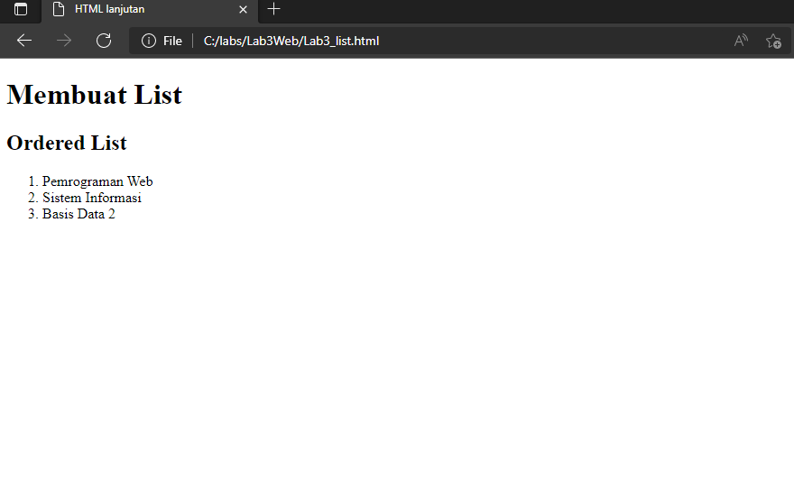

 Dan yang kedua, kalian lakuan pembuatan *Unorderd List* dengan menambahkan kode perintah seperti gambar berikut:
 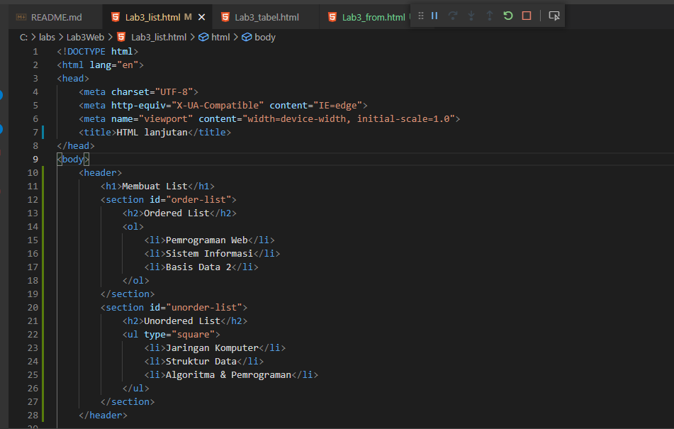
 Seprti biasa kalian run dan lihat hasilnya digoogle crome.
 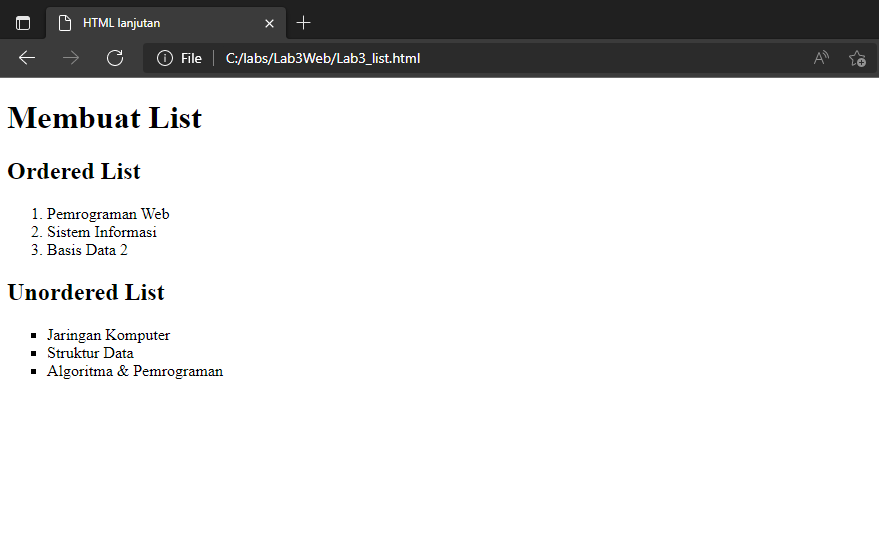

 Dan yang ketiga, Kalian lakukan pembuatan *Description List* dengan menambahkan kode perintah seperti gambar berikut:
 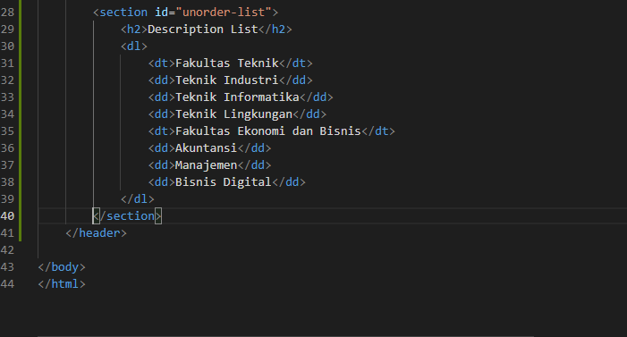
 Seprti biasa kalian run dan lihat hasilnya digoogle crome.
 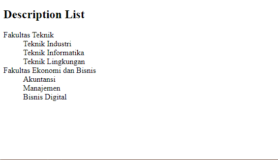

 **2. File Kedua Dinamakan "Lab3_list.html"**
 Disini yang pertama, kalian membuat kode perintah seoerti gambar berikut:
 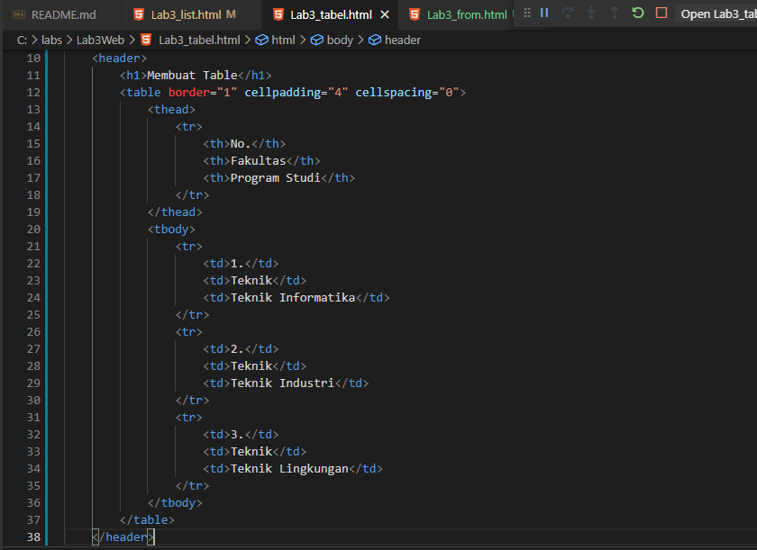
 Seperti biasa kalian run dan lihat hasilnya digoogle crome.
 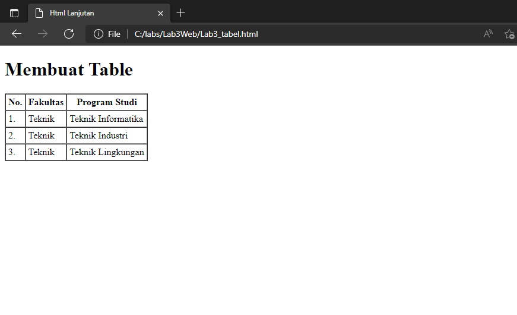

 Dan yang kedua, kalian lakukan *Penggabungan Sel Data* dengan mengubah kode perintah seprti gambar berikut:
 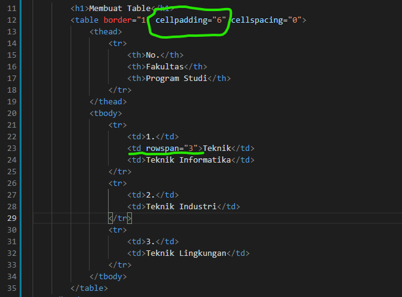 
 Seperti biasa kalian run dan lihat hasilnya digoogle crome.
 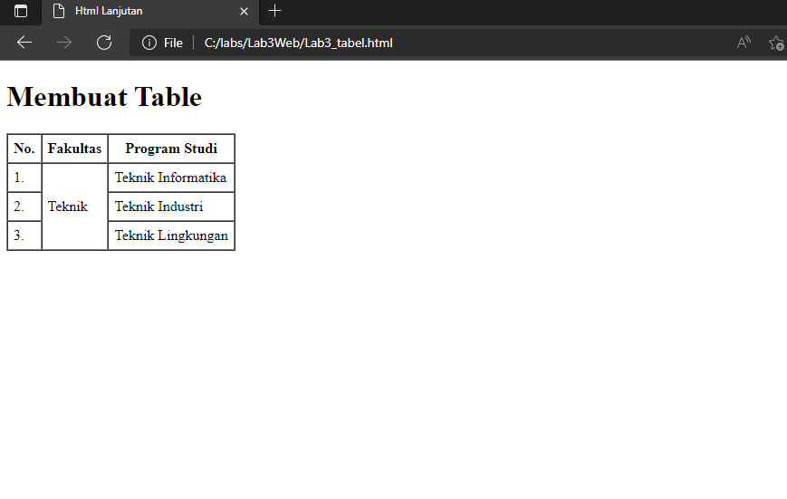

 **3. File Ketiga Dinamakan "Lab3_from.html**
 Pada file terakhir ini, Kalian pertama Membuat kode perintah seperti gambar berikut:
 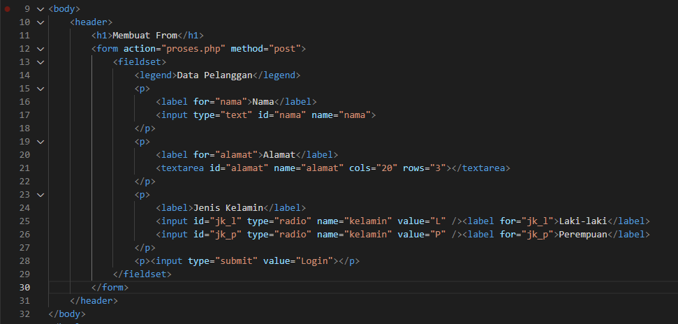
